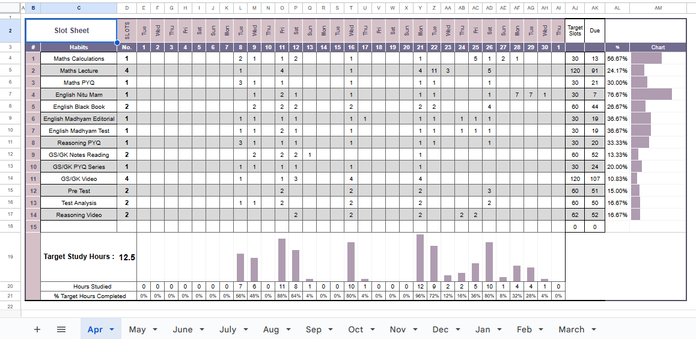
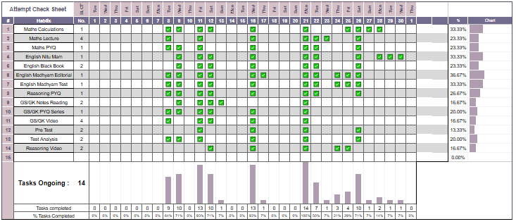
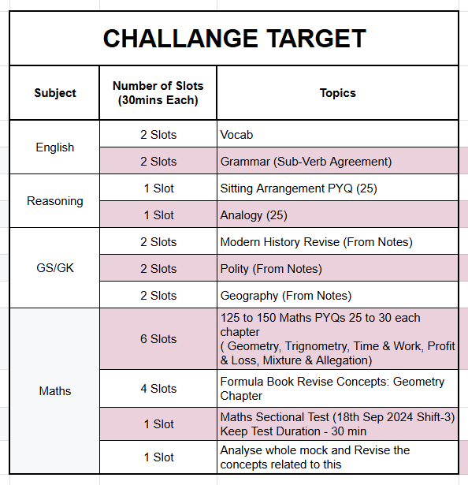

---

# 📝 Daily Habit Tracking Todo App

A clean, minimal, and powerful **Todo App for Daily Habit Tracking** that helps you stay consistent with your goals using a unique **slot-based time tracking system**. Set monthly time targets, log daily work in 30-minute slots, and watch your progress grow!

## 🚀 Features

* ✅ **Add Habits with Slots:** Add habits **once per month** and assign time-based targets using **slots** (1 slot = 30 minutes).
* 🕒 **Slot-Based Tracking:** Track your habits daily by logging completed slots (e.g., Python Practice – 2 slots = 1 hour).
* 🎯 **Monthly Target System:** Habits are tracked toward monthly goals set at the beginning of the month.
* 📈 **Progress Charts:** Visualize your progress through bar or line graphs.
* 📊 **CSV Export:** Automatically saves all habit progress in a `CSV` file for history tracking.
* 🔁 **Auto Monthly Reset:** Reset progress every month, keeping past performance saved.
* 💾 **Persistent Storage:** Save all progress locally using JSON or CSV.
* 🌗 **Dark/Light Mode** (optional depending on UI)

---

## 📸 Screenshot






---

## 🧠 Example Setup

| Habit           | Monthly Target (Slots) | Completed (Slots) | Time Spent | Progress |
| --------------- | ---------------------- | ----------------- | ---------- | -------- |
| Python Practice | 20                     | 10                | 5 hours    | 50%      |
| Math Practice   | 10                     | 6                 | 3 hours    | 60%      |
| Exercise        | 15                     | 15                | 7.5 hours  | 100% ✅   |

* Set goals like:

  * 🧠 Python Practice – 20 slots (10 hours)
  * 🧮 Math Practice – 10 slots (5 hours)
  * 💪 Exercise – 15 slots (7.5 hours)

---

## 📈 Graphical Progress (Example)

Visualize habit progress over time:

* 📊 Bar chart showing % completion per habit
* 📉 Line chart showing daily accumulation of slots
* 📅 Weekly breakdown of time spent

> Uses `matplotlib` to generate and display habit graphs.

---

## 📤 CSV Format

Progress is saved to `habit_progress.csv` like this:

```
Date, Habit, Target Slots, Completed Slots, Time Spent (Hrs), Percentage
2025-05-12, Python Practice, 20, 10, 5.0, 50%
2025-05-12, Math Practice, 10, 6, 3.0, 60%
```

---

## 📦 Tech Stack

* **Frontend:** Tkinter / CustomTkinter (optional)
* **Backend:** Python
* **Storage:** JSON + CSV
* **Graphs:** `matplotlib`

---

## 🔧 How to Use

1. **Set Monthly Goals:** Add habits with their monthly target in slots (30 min per slot).
2. **Log Daily Work:** Check off how many slots (time blocks) you completed for each habit.
3. **Visualize Progress:** Use built-in charts to view your monthly progress.
4. **Auto Save:** All progress is saved to CSV and updates every day.
5. **Reset Monthly:** On the 1st of every month, start fresh with your predefined habit goals.

---

## 🔮 Planned Features

* Streak system
* Weekly summaries
* Custom slot duration (e.g., 15, 45 minutes)
* Cloud sync
* Pomodoro timer integration

---

## 🤝 Contributing

Pull requests and suggestions are welcome! Let’s improve this habit tracker together.

## 📄 License

Licensed under the [MIT License](LICENSE).

---


